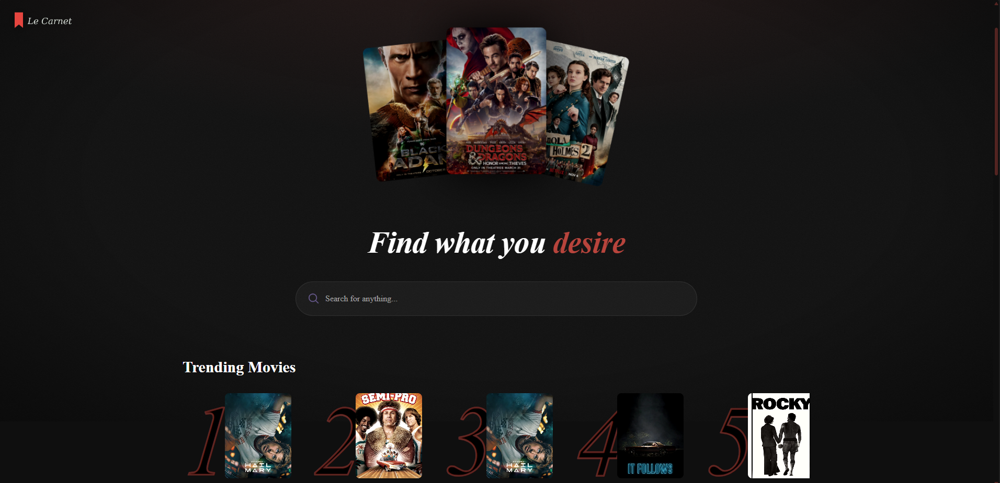
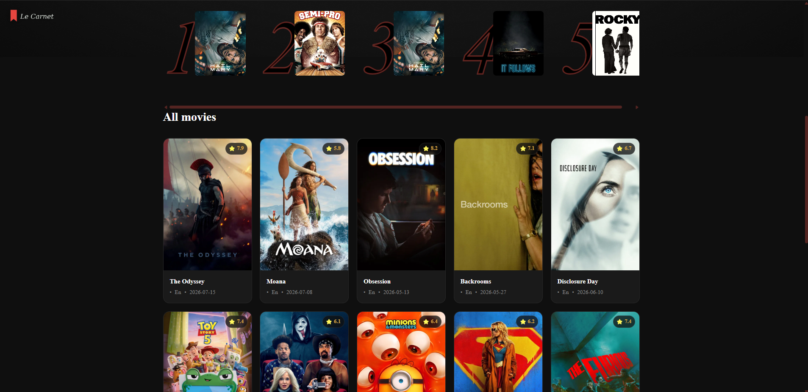
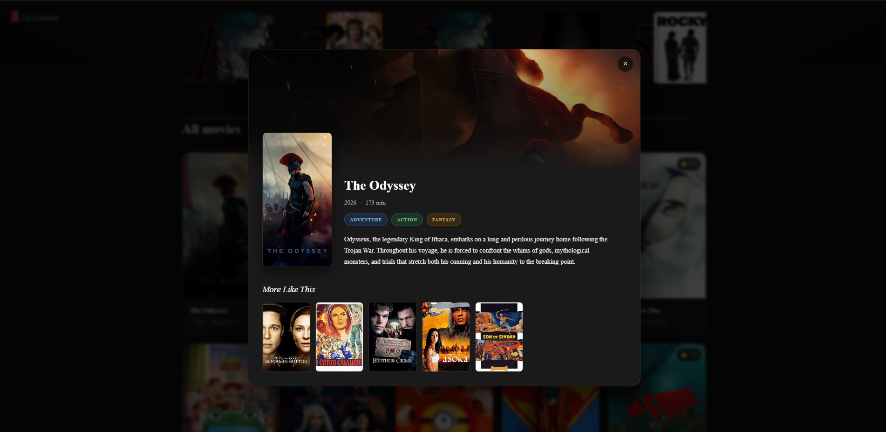
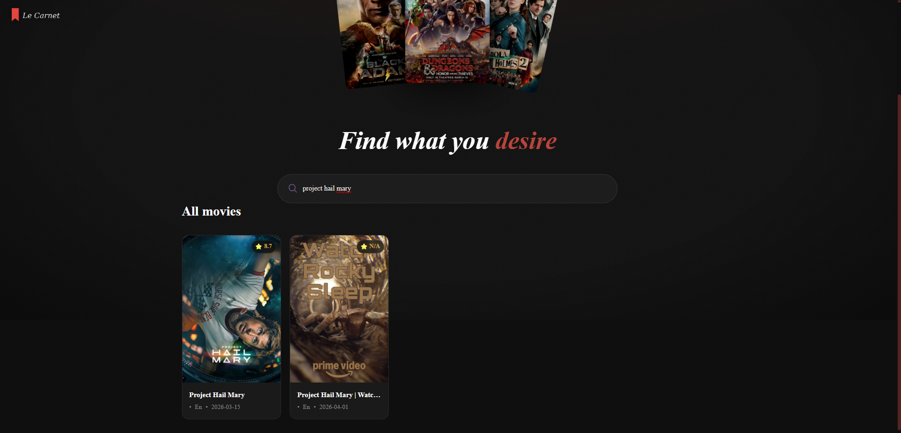
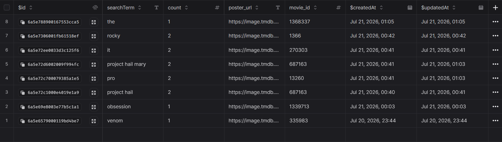

<div align="center">

# 🎬 Le Carnet

### *Find what you desire.*

A cinematic, editorial-styled movie discovery app — search, live trending analytics, and rich detail views, wrapped in a dark, theatre-inspired aesthetic.

[](https://react.dev/)
[](https://vitejs.dev/)
[](https://tailwindcss.com/)
[](https://appwrite.io/)
[](https://www.themoviedb.org/)

</div>

<br/>

<div align="center">
  
</div>

<br/>

## Overview

**Le Carnet** — French for *"the notebook"* — is a movie discovery web app built to feel less like a database query tool and more like flipping through a personal film journal: dark, warm, editorial, and unmistakably cinematic.

It pulls live data from **The Movie Database (TMDB)** for search and film metadata, and uses **Appwrite** as a lightweight backend to track real search activity and turn it into a live "Trending" leaderboard. Nothing is hardcoded or manually curated — the trending list reflects what people are actually searching for, in real time.

<br/>

## ✨ Features

- **Live search** against the TMDB catalog, debounced to avoid hammering the API on every keystroke
- **Real trending analytics** — every search increments a counter in an Appwrite database; the 5 most-searched titles surface as a "Trending" rail, ranked and updated in real time
- **Cinematic detail modal** — clicking any poster opens a full detail view with backdrop art, runtime, genre tags, synopsis, and a "More Like This" recommendation rail pulled from TMDB's similarity engine
- **Recursive browsing** — clicking a recommended film inside the modal swaps the modal content in place, letting you fall down a rabbit hole of related films without ever closing the window
- **Custom hover choreography** — trending posters sharpen from grayscale to full color and lift with a crimson glow on hover; grid cards lift and highlight on interaction
- **Procedural film-grain background** — the backdrop texture is pure CSS (SVG turbulence noise + radial vignette), no image asset required
- **Fully responsive grid** — scales from 1 to 5 columns depending on viewport, from mobile to widescreen desktop
- **Custom design system** — themed scrollbars, a sticky navigation logo, and a full visual language built entirely on Tailwind v4's CSS-first `@theme` config, no default Tailwind palette in sight

<br/>

## 📸 Screenshots

<div align="center">

**Landing & Trending**


<br/><br/>

**Film Detail Modal**


<br/><br/>

**Search & Browse Grid**


</div>

<br/>

## 🛠 Tech Stack

| Layer | Technology |
|---|---|
| **Framework** | React 19 (functional components + hooks) |
| **Build tool** | Vite |
| **Styling** | Tailwind CSS v4 (CSS-first `@theme` config, no `tailwind.config.js`) |
| **Fonts** | Playfair Display (editorial serif) + DM Sans |
| **Movie data** | TMDB API — search, discover, details, and similar-movies endpoints |
| **Backend / analytics** | Appwrite Databases — tracks search terms and frequency |
| **State management** | React `useState` / `useEffect`, no external state library |
| **Debouncing** | `use-debounce` |

<br/>

## 🧠 How the trending system works

Unlike a static "popular movies" list, Le Carnet's trending rail is driven by **real usage data**:

1. Every time someone searches for a film and gets a result, `updateSearchCount()` fires.
2. Appwrite checks whether that search term already has a document — if so, it increments the `count`; if not, it creates a new one.
3. On load, `getTrendingMovies()` queries Appwrite for the top 5 documents sorted by `count` descending.
4. Those five become the "Trending" rail — a genuine, crowd-sourced leaderboard, not a hardcoded list.

<div align="center">
  
</div>

<br/>

## 🚀 Getting Started

### Prerequisites

- [Node.js](https://nodejs.org/) 18+ and npm
- A free [TMDB API key](https://www.themoviedb.org/settings/api)
- A free [Appwrite](https://appwrite.io/) project with a database and collection set up for search tracking

### Setup

```bash
# clone the repo
git clone https://github.com/Kishik-K/Le-Carnet.git
cd Le-Carnet

# install dependencies
npm install

# add your environment variables
cp .env.example .env.local
```

Fill in `.env.local` with your own keys:

```env
VITE_TMDB_API_KEY=your_tmdb_api_key
VITE_APPWRITE_PROJECT_ID=your_appwrite_project_id
VITE_APPWRITE_DATABASE_ID=your_appwrite_database_id
VITE_APPWRITE_COLLECTION_ID=your_appwrite_collection_id
```

```bash
# run the dev server
npm run dev
```

<br/>

## 📁 Project Structure

```
Le-Carnet/
├── public/
│   ├── logo.png
│   ├── hero.png
│   ├── hero-bg.png
│   └── no-movie.png
├── src/
│   ├── components/
│   │   ├── search.jsx
│   │   ├── spinner.jsx
│   │   ├── movieCard.jsx
│   │   └── movieModal.jsx
│   ├── appwrite.js
│   ├── App.jsx
│   └── index.css
└── package.json
```

<br/>

## 🎯 What I learned building this

- Structuring a component-driven React app with clean prop-passing for shared modal state across sibling components (the grid, trending rail, and recommendation rail all control the same modal)
- Designing a full custom design system in Tailwind v4's newer CSS-first syntax instead of the traditional JS config
- Working with two external APIs simultaneously (TMDB for content, Appwrite for backend state) and keeping fetches resilient with `Promise.all` and proper loading/error states
- Building UI details that read as "designed" rather than "default" — grain textures, vignettes, genre-tag color systems, and hover choreography

<br/>

## 🗺 Roadmap

- [ ] User accounts with personal watchlists and watched history
- [ ] Star ratings and review notes per film
- [ ] Filter/sort by genre, year, and rating
- [ ] Deploy live demo

<br/>

---

<div align="center">
  <sub>Built with 🎞️ by <a href="https://github.com/Kishik-K">Kishik-K</a></sub>
</div>
